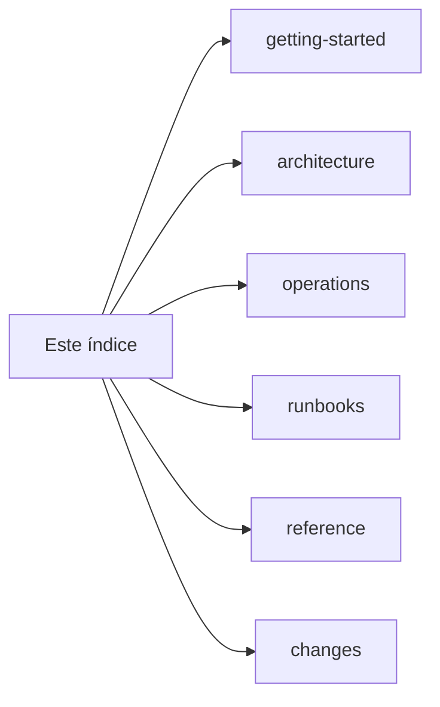

# Documentação — Empresarial GRNO

> Última revisão: **2026-08-06**

Mapa único da documentação. Conteúdo vivo **não** usa data no nome; datas ficam só em notas históricas e ADRs.

## Começar aqui

| Você quer…             | Documento                                                                                                               |
| ---------------------- | ----------------------------------------------------------------------------------------------------------------------- |
| **Subir o lab**        | [getting-started/development.md](getting-started/development.md)                                                        |
| **Banco local**        | [getting-started/database.md](getting-started/database.md)                                                              |
| **Instalar produção**  | [runbooks/production-install.md](runbooks/production-install.md)                                                        |
| **Atualizar produção** | [runbooks/production-release.md](runbooks/production-release.md)                                                        |
| **Verificar o host**   | [runbooks/production-inventory.md](runbooks/production-inventory.md)                                                    |
| **Ingest BSOD**        | [runbooks/bsod-ingest.md](runbooks/bsod-ingest.md)                                                                      |
| **Arquitetura**        | [architecture/overview.md](architecture/overview.md)                                                                    |
| **Config / APIs**      | [reference/configuration.md](reference/configuration.md) · [reference/routes-and-apis.md](reference/routes-and-apis.md) |
| **Contribuir**         | [../CONTRIBUTING.md](../CONTRIBUTING.md)                                                                                |
| **Changelog**          | [../CHANGELOG.md](../CHANGELOG.md)                                                                                      |

**Lab** e **produção** usam o mesmo repo e a porta **3003**, mas usuários, units systemd e carga de dados são diferentes — não misture units `*-lab*` com units de prod no mesmo host.

---

## Por pasta

| Pasta                                              | Conteúdo                                                         |
| -------------------------------------------------- | ---------------------------------------------------------------- |
| [getting-started/](getting-started/development.md) | Lab, banco local                                                 |
| [architecture/](architecture/overview.md)          | Fronteiras, fluxos, ADRs                                         |
| [operations/](operations/deployment.md)            | Modelo de deploy, serviços, troubleshooting                      |
| [runbooks/](runbooks/production-release.md)        | Procedimentos copy-paste (install, release, migrations, workers) |
| [reference/](reference/configuration.md)           | Env, rotas/APIs, dados, layout                                   |
| [changes/](changes/README.md)                      | Notas históricas de rollout                                      |

Co-localizado:

| Local                                                           | Escopo                       |
| --------------------------------------------------------------- | ---------------------------- |
| [deploy/README.md](../deploy/README.md)                         | Inventário das units systemd |
| [workers/sir-ingest/README.md](../workers/sir-ingest/README.md) | Contrato do scraper SIR      |
| [workers/tmip/README.md](../workers/tmip/README.md)             | Contrato do ingest TMIP/SDH  |
| [workers/bsod/README.md](../workers/bsod/README.md)             | Contrato do ingest PME/BSoD  |

---

## Caminhos legados

Documentos datados antigos apontam para os canônicos (stubs de redirecionamento). Preferir sempre os caminhos desta tabela.
