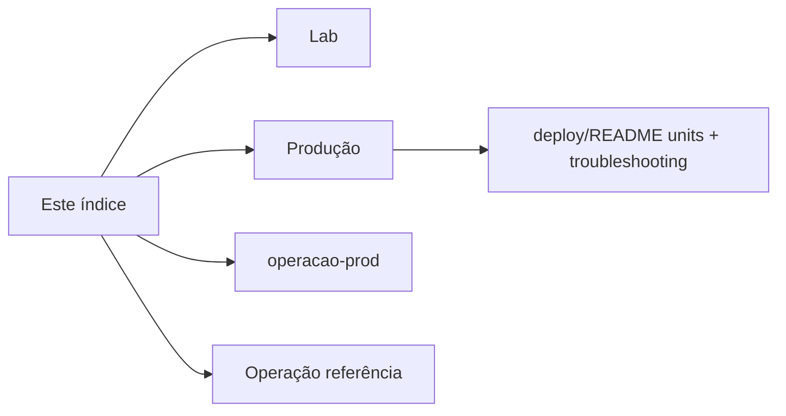

# Documentação — Empresarial GRNO

> Última revisão: **2026-07-29**

Toda a documentação do projeto fica nesta pasta. Escolha o caminho conforme o ambiente.

## Começar aqui

| Você quer…                               | Documento                                                          |
| ---------------------------------------- | ------------------------------------------------------------------ |
| **Subir o lab** (WSL / `User=rcard`)     | **[2026-07-27-lab.md](2026-07-27-lab.md)**                         |
| **Deploy ou atualizar produção**         | **[2026-07-26-deploy-producao.md](2026-07-26-deploy-producao.md)** |
| **Delta manual** pós-pull (lab/prod)     | **[operacao-prod/README.md](operacao-prod/README.md)**             |
| **Referência** (APIs, env, GRB, páginas) | **[2026-07-26-operacao.md](2026-07-26-operacao.md)**               |

**Lab** e **produção** usam o mesmo repo e a porta **3003**, mas usuários, units systemd e carga de dados são diferentes — não misture units `*-lab*` com units de prod no mesmo host.

---

## Por tema

| Tema                    | Documento                                                       |
| ----------------------- | --------------------------------------------------------------- |
| Lab (setup completo)    | [2026-07-27-lab.md](2026-07-27-lab.md)                          |
| Produção (checklist)    | [2026-07-26-deploy-producao.md](2026-07-26-deploy-producao.md)  |
| Units + troubleshooting | [deploy/README.md](../deploy/README.md)                         |
| Pendências manuais      | [operacao-prod/README.md](operacao-prod/README.md)              |
| Arquitetura / APIs / UI | [2026-07-26-operacao.md](2026-07-26-operacao.md)                |
| Bots Telegram SIR       | [2026-07-26-bots-telegram.md](2026-07-26-bots-telegram.md)      |
| Worker ingest           | [workers/sir-ingest/README.md](../workers/sir-ingest/README.md) |
| Planos                  | [plans/README.md](plans/README.md)                              |

---

## Índice por data

| Data       | Documento                                                      | Assunto                                     |
| ---------- | -------------------------------------------------------------- | ------------------------------------------- |
| 2026-07-27 | [2026-07-27-lab.md](2026-07-27-lab.md)                         | Setup lab (WSL / units `-lab`)              |
| 2026-07-26 | [operacao-prod/README.md](operacao-prod/README.md)             | Pendências lab/prod — delta manual pós-pull |
| 2026-07-26 | [2026-07-26-bots-telegram.md](2026-07-26-bots-telegram.md)     | Units e mapa dos bots Telegram SIR          |
| 2026-07-26 | [2026-07-26-operacao.md](2026-07-26-operacao.md)               | Referência: env, páginas, APIs, GRB/Critel  |
| 2026-07-26 | [2026-07-26-deploy-producao.md](2026-07-26-deploy-producao.md) | Checklist de deploy em produção (Debian)    |

O [README](../README.md) na raiz só resume o projeto e aponta para cá.
