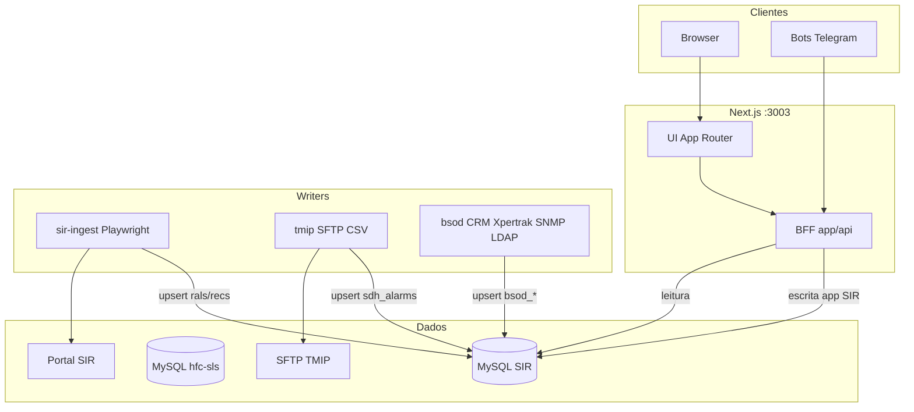

# Arquitetura — Empresarial GRNO

> Última revisão: **2026-07-30** · Índice: [../README.md](../README.md)

Visão estrutural do monorepo: fronteiras de escrita, fluxos de dados e responsabilidades por camada.

- Fronteiras detalhadas: [data-and-write-boundaries.md](data-and-write-boundaries.md)
- Rotas e APIs: [../reference/routes-and-apis.md](../reference/routes-and-apis.md)
- Env: [../reference/configuration.md](../reference/configuration.md)

## Visão geral

## Fronteiras (resumo)

| Camada      | Local                          | Lê                       | Escreve                                  |
| ----------- | ------------------------------ | ------------------------ | ---------------------------------------- |
| UI + BFF    | `app/`, `components/`, `lib/`  | SIR, HFC                 | Tabelas de aplicação no SIR (ver abaixo) |
| Ingest SIR  | `workers/sir-ingest/`          | Portal SIR               | `rals`, `recs`                           |
| Ingest TMIP | `workers/tmip/`                | SFTP CSV                 | `sdh_alarms`                             |
| Ingest BSOD | `workers/bsod/`                | CRM + Xpertrak/SNMP/LDAP | `bsod_*` (cables/inventory/monitor/crm)  |
| Telegram    | `workers/sir-ingest/telegram/` | HTTP Next `/api`         | Não grava DB                             |
| Migrations  | `migrations/sir/`              | —                        | DDL SIR                                  |

**Next escreve no SIR** em: `app_users`, preferências, notificações, `app_tratativas` / eventos, colunas/eventos de tratativa SDH, e edição manual de `bsod_inventory` (cliente/endereço).

**Next não escreve** em: `hfc-sls`, nem nas tabelas-fonte `rals` / `recs` (só workers).

Regras duras:

- Scrapers e Selenium **não** entram em `app/`.
- Este repo **não escreve** no MySQL `hfc-sls`.
- Next e workers compartilham `SIR_DB_*` idênticos (`npm run env:check`).

## Domínios de monitoramento

| Domínio   | Fonte                       | Tabela / leitura                                     | Tratativa                        |
| --------- | --------------------------- | ---------------------------------------------------- | -------------------------------- |
| RAL / REC | Scrape SIR                  | `rals`, `recs`                                       | `app_tratativas` + eventos       |
| BSOD      | Worker `workers/bsod` + SIR | `bsod_inventory`, `bsod_monitor`, `bsod_crm_clients` | `app_tratativas` (workflow FCA)  |
| SDH       | CSV TMIP >6h                | `sdh_alarms`                                         | Colunas + `sdh_tratativa_events` |

## Tratativa unificada

O painel lateral (`TratativaPanel`) assume o registro, registra observação/WhatsApp e mostra cronologia.

- BSOD: validação, FCA e conclusão no mesmo painel.
- RAL/REC: observação e acionamento enquanto aberto; se a fonte encerrar com tratativa ativa, permanece em **Normalizados aguardando confirmação** até liberação ou **Encerrar** (com observação).
- SDH: claim/observação/encerramento com `START` / `OBSERVACAO` / `CLOSE`; alarme inativo com tratativa aberta permanece na seção de normalizados (claim só em ativo).
- Concorrência: no máximo uma tratativa ativa por domínio/chave (migration `013`).

## Relatórios

| Rota                     | Semântica                                             |
| ------------------------ | ----------------------------------------------------- |
| `/relatorios/tratativas` | Coorte BSOD (iniciados no período) + atividade diária |
| `/relatorios/sir`        | Backlog ATIVO RAL/REC + aberturas no período          |
| `/relatorios/sdh`        | Backlog ativo + histórico de eventos no período       |
| `/relatorios/exportacao` | CSV de listagens filtradas                            |

Rankings sensíveis ficam restritos a `STAFF`.

## Autenticação

- Sessão JWT em cookie HTTP-only.
- Perfis: `USER` (aprovado) e `STAFF` (administração e rankings sensíveis).
- Cadastro em `/cadastro` com aprovação em `/admin/usuarios`.

## Deploy

| Ambiente   | Guia                                                                       | Units                                  |
| ---------- | -------------------------------------------------------------------------- | -------------------------------------- |
| Lab        | [../getting-started/development.md](../getting-started/development.md)     | `*-lab*` · `User=rcard`                |
| Produção   | [../runbooks/production-install.md](../runbooks/production-install.md)     | sem `-lab` · `User=datacenter`         |
| Release    | [../runbooks/production-release.md](../runbooks/production-release.md)     | restart seletivo                       |
| Inventário | [../runbooks/production-inventory.md](../runbooks/production-inventory.md) | verificar host antes de assumir status |

Porta padrão: **3003**.
